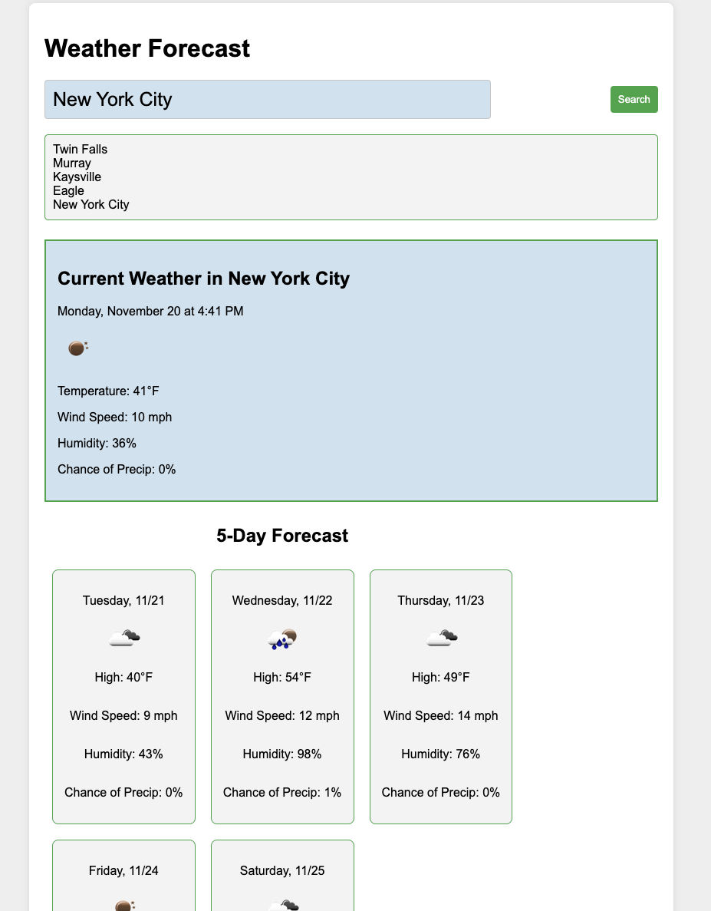

# Weather Dash
This is a a weather forecast tool. It includes the current weather conditions for a selected US city, as well as a 5-day forecast. 

## User Experience
The user first types in the US city of interest, or if the app has already been used on this device, user can select a city that has already been seen and saved to local storage by clicking it.  Two things will then happen:

1. the current weather conditions of the selected city will be shown; and

2. A 5-day forecast will be shown on individual weather cards below the the current weather display area.

Weather data from the API is updated every three hours.

## Screen Shot

 
 ## Live App
 The live application can be found here:
 https://stever001.github.io/weather-dash/

## Contact Me Wih Questions or Comments
You may contact me with any questions regarding this app at:

steve17rouse@gmail.com

208.794.2800
